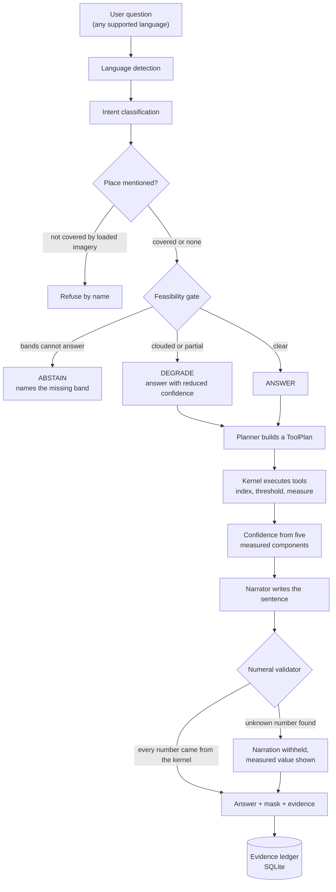
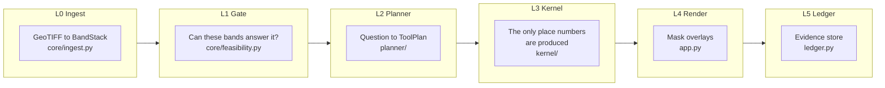
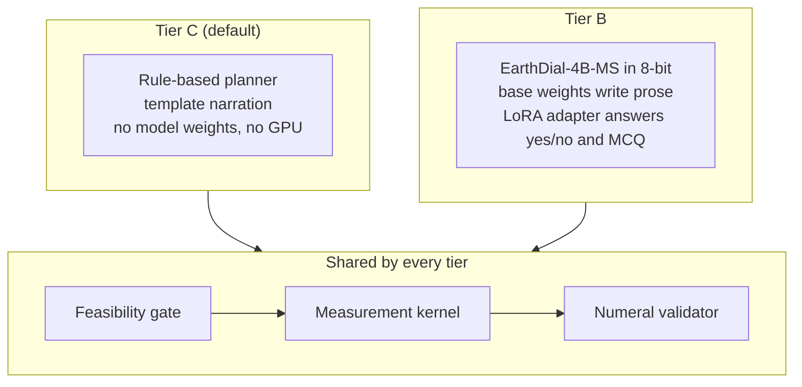
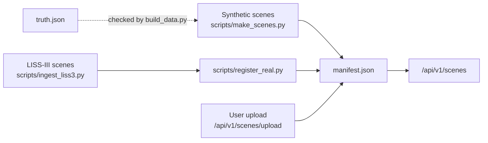

# SatQuery AI

SatQuery AI lets you ask plain-language questions about satellite imagery and get back answers you can check. Ask "how much area is flooded?" and it returns a figure in hectares, a confidence score, a mask showing which pixels were counted, and a record of every step that produced the number. Ask it in Hindi, Hinglish, Punjabi, Bengali, Tamil or Telugu and the answer comes back in that language, with the same figure.

The project is built around one rule: **no number reaches the user unless a deterministic function computed it from actual pixels.** A language model can plan a query and phrase the answer, but it never measures anything. Everything else in the design follows from that rule.

## Why it is built this way

Vision-language models are good at describing images and bad at measuring them. Ask one how many hectares of a district are under water and it will give you a confident, plausible and usually invented number. In disaster response a plausible wrong number is worse than no answer, because nobody thinks to question it.

SatQuery splits the work. The spectral maths (water indices, thresholding, pixel counting, area conversion) happens in a small, fully tested kernel of ordinary NumPy code. A planner decides which kernel tools to run for a given question. A narrator then turns the kernel's results into a sentence. The narrator can be a set of templates or a fine-tuned model, but either way its output goes through a validator that rejects any numeral the kernel did not produce. If the model writes "about 2,400 hectares" when the kernel measured 2,603.12, that sentence is thrown away and the measured value is shown instead.

The system is also allowed to say no. Before anything is computed, a feasibility gate checks whether the loaded bands can answer the question at all. A burn-scar question on imagery with no SWIR2 band is refused, and the refusal names the band that would be needed. A flood question on a heavily clouded scene is answered, but with a lower confidence that says why. A question about a district the system holds no imagery for is refused by name, instead of being quietly answered from whichever scene happens to be open.

## How a question is answered



Language detection uses Unicode script blocks, which is exact because the Indic scripts occupy separate ranges. Hinglish shares the Latin block with English, so it is picked up by romanised markers instead. None of the reply templates contain a numeral. Numbers arrive as parameters from the kernel, which means a translation cannot change a figure, and the same flood question asked in seven languages returns the same hectares.

Confidence is never a model output. It is the product of five measured components, such as cloud fraction and how stable the measured area stays when the threshold is moved. On the clear flood scene it comes out around 0.98. On the clouded version of the same scene it drops to about 0.36, and the answer says so.

## Architecture

The backend is arranged in layers. Each layer has one job, and only the kernel produces numbers.



A few rules hold across the whole codebase. `BandStack.band(role)` raises `BandUnavailable` rather than substituting another band, because a wrong band gives a plausible wrong number, which is exactly the failure this project exists to prevent. Every kernel tool returns a `ToolResult` whose provenance is enough to recompute the value from the source raster alone. The server makes no outbound network requests at runtime, and it exposes a counter at `/api/v1/health` to show that.

The kernel is a small registry of tools that the planner chains together: `compute_index`, `threshold_mask`, `mask_difference`, `measure_area`, `threshold_sensitivity` and `zonal_stats`. A flood-extent question, for example, becomes a three-step plan: compute MNDWI, threshold it with Otsu's method, and convert the pixel count to hectares using the pixel area recorded in the GeoTIFF.

## Tiers

The planner and narrator can be swapped without touching the kernel. The active tier is chosen with the `SATQUERY_TIER` environment variable, and because the kernel is identical in every tier, the numbers cannot change between them.



Tier C is rule-based and needs no model weights. It is a complete system in its own right, and it is what runs when no GPU is available.

Tier B loads EarthDial-4B-MS, a remote-sensing vision-language model built on Phi-3, together with a LoRA adapter fine-tuned for this project. The adapter was trained on single-word targets (yes/no and multiple-choice letters), so it is used only for classification through `/api/v1/classify`, and the base weights write the narration. peft's `disable_adapter()` switches between the two without loading the model twice. On the BigEarthNet bench split (4,537 questions) the fine-tune scores 60.1%, against 9.7% for the base model.

The model is loaded in 8-bit because EarthDial-4B needs about 8.7 GB in bf16, which does not fit on an 8 GB laptop GPU. 4-bit is available with `SATQUERY_4BIT=1`, but it faults on some sm_89 cards with the current torch build, so 8-bit is the default. If the weights are missing or fail to load, the app falls back to Tier C and reports the reason at `/api/v1/health`.

Retrieval of reference material (index definitions, sensor notes, flood-mapping methods) uses sentence-transformers embeddings in a FAISS index when those packages are installed, and falls back to BM25 when they are not. The health endpoint shows which one is active, and why if it fell back.

## Running it

### Tier C

Tier C needs only a handful of packages and no GPU.

```bash
pip install rasterio numpy pillow scikit-image pydantic fastapi "uvicorn[standard]" httpx
python run.py
```

`run.py` builds the demo scenes if they are missing, runs every backend self-check, frees port 8000 if an earlier run is still holding it, starts the server, checks the UI in a real browser and then opens it. There is no npm and no build step.

### Tier B

Tier B needs a CUDA GPU and the model weights under `models/`: the EarthDial base model in `models/EarthDial_4B_MS`, the EarthDial source in `models/EarthDial`, and the adapter in `models/lora_adapter`.

```bash
pip install sentence-transformers faiss-cpu python-multipart
pip install --index-url https://download.pytorch.org/whl/cu121 torch torchvision
pip install "transformers>=4.49,<4.57" peft accelerate bitsandbytes sentencepiece protobuf
```

Install `torch` and `torchvision` from the cu121 index together. Installing something from PyPI afterwards can pull a CPU-only `torch` over the CUDA build, after which `torch.cuda.is_available()` quietly returns False. Do not upgrade transformers past 4.56, because EarthDial vendors Phi-3 and relies on internals that moved after that release. `python-multipart`, `torchvision`, `sentencepiece` and `protobuf` are all easy to leave out, and each one breaks either the upload routes or the model load when missing.

The project keeps its Tier B environment in `.venv-tierb`. To start it from Git Bash:

```bash
SATQUERY_TIER=B .venv-tierb/Scripts/python.exe run.py
```

PowerShell sets environment variables differently:

```powershell
$env:SATQUERY_TIER="B"; .\.venv-tierb\Scripts\python.exe run.py
```

Startup takes a while in Tier B, because the embedding index and the model are both loaded before the server accepts its first question. That way the first user does not pay for the load. Once it is up, the header shows "Tier B · VLM loaded", and `/api/v1/health` gives the full status.

On Windows machines with Smart App Control turned on, newer `rasterio` and `faiss-cpu` wheels can be blocked with `ImportError: DLL load failed ... An Application Control policy has blocked this file`. A blocked `rasterio` stops the server from starting, and a blocked `faiss` silently drops retrieval to BM25. Pinning to versions Windows accepts fixes both:

```bash
.venv-tierb/Scripts/python.exe -m pip install "rasterio==1.4.3" "faiss-cpu==1.9.0.post1"
```

### Other run modes

```bash
python run.py --full        # rebuild the demo scenes first (about 90 s)
python run.py --check       # build and verify only, no server
python run.py --serve       # skip checks and just serve (fastest restart)
python run.py --port 8001   # serve on another port
python run.py --no-open     # do not open a browser
```

Each step can also be run by itself. `python scripts/build_data.py` regenerates the scenes and checks them against ground truth, `python scripts/check.py` runs the backend self-checks, and `python scripts/ui_check.py` drives the UI in a browser against a running server. Every backend module also has its own self-check, runnable with `python -m backend.<module>`.

## Data

The project ships two kinds of imagery.

The first is a set of synthetic demo scenes over the Kosi basin in Supaul district, Bihar: before and after a flood, a clouded copy of the flooded scene, a burned forest, an urban growth pair and a barren control. They are generated with fixed seeds and have exact ground truth, so every figure the kernel produces can be checked against `data/demo/truth.json` to within 0.1%. Their reflectance signatures are physically realistic, so the spectral indices behave as they would on real data. Synthetic scenes are tagged `SATQUERY_SYNTHETIC=1` in the GeoTIFF metadata and carry a SYN badge in the UI, and that should stay true. See [data/README.md](data/README.md) for how they are made.

The second is real Resourcesat-2/2A LISS-III imagery of the same area: eight acquisitions between July 2022 and February 2023 from the Bhoonidhi portal, at 24 m resolution with the same four bands. Nobody has labelled these scenes, so they have no ground truth to check against. They are there to show the same question and the same kernel working on a measured scene next to a modelled one. You can also upload your own GeoTIFFs through the UI.



One known gap is deliberate. The burn-scar question on `forest_burn` is refused, because the Normalised Burn Ratio needs SWIR2 (Sentinel-2 band 12) and these scenes only carry SWIR1. LISS-III has the same four-band limit, so the refusal is the correct behaviour, not a bug.

## API

The frontend is a single HTML file that talks to a small FastAPI backend.

| Endpoint | Purpose |
|---|---|
| `GET /api/v1/health` | Active tier, model and retrieval status, scene count, outbound-request counter |
| `GET /api/v1/scenes` | Scene catalogue |
| `GET /api/v1/scenes/{id}` | One scene with its band facts |
| `POST /api/v1/scenes/upload` | Add a GeoTIFF |
| `GET /api/v1/scenes/{id}/mask.png` | Mask overlay for an intent, recomputed by the kernel |
| `POST /api/v1/query` | Ask a question, get an answer and a turn id |
| `POST /api/v1/translate` | Re-narrate an answer in another language |
| `POST /api/v1/classify` | Yes/no or multiple-choice answer from the fine-tuned adapter |
| `GET /api/v1/evidence/{turn_id}` | Full evidence record for one answer |
| `GET /api/v1/knowledge` | Search the reference corpus |
| `GET /api/v1/ledger` | Recent answers |

`/api/v1/classify` is kept separate from `/api/v1/query` on purpose. It returns a bare label with no measurement fields, so a model token can never be mistaken for a number the kernel computed.

## Project layout

```
backend/
  schemas.py        wire contracts (Pydantic v2)
  core/             band stack, ingest, upload, feasibility gate
  kernel/           spectral indices, segmentation, measurement, executor, tool registry
  planner/          intent, language, places, phrases, Tier B and Tier C, numeral validator
  rag/              dense and BM25 retrieval over the reference corpus
  pipeline.py       the one function that answers a question
  ledger.py         SQLite evidence store
  app.py            FastAPI application
frontend/index.html the whole UI in one file, React from vendored scripts, no build
scripts/            scene generation, ingestion and checks
data/               demo and real scenes, knowledge corpus, uploads
models/             EarthDial weights and the LoRA adapter (Tier B only)
docs/screens/       screenshots from the last UI check
```
